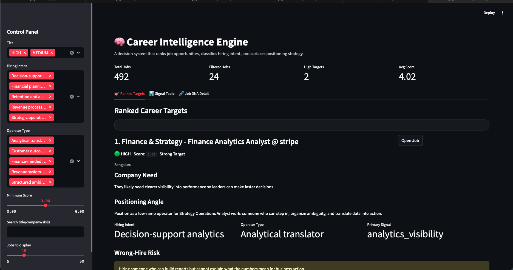

# 🧠 Career Intelligence Engine

Career Intelligence Engine is a Python + Streamlit decision system that ingests real job postings, scores opportunity fit, classifies hiring intent, identifies wrong-hire risk, and generates role-specific positioning strategy.

Built to replace blind job applications with structured opportunity intelligence.

> Find the roles you are most likely to win — and understand exactly why.

Career Intelligence Engine is a decision system that analyzes job opportunities, predicts hiring intent, and generates positioning strategy.

It doesn’t just answer:
> “Do I qualify?”

It answers:
> “What problem is this company trying to solve—and how do I position myself as the solution?”

---

## 📊 Product Preview



---

## 🚀 Start Here (Run in 60 seconds)

```bash

pip install -r requirements.txt

python run_pipeline.py --greenhouse stripe

streamlit run app/streamlit_app.py

```

👉 Then open: http://localhost:8501

---

## ⚡ Core Value

| Traditional Job Search | Career Intelligence Engine |
|----------------------|---------------------------|
| Keyword matching | Business-problem matching |
| Guessing fit | Weighted opportunity scoring |
| Generic applications | Role-specific positioning |
| Spray-and-pray | Strategic targeting |
| Resume-first thinking | Problem-first thinking |

---

## 🧬 What the System Does

- Ingests real job postings (Greenhouse API)
- Extracts structured signals (skills, tools, keywords)
- Scores alignment across weighted dimensions
- Classifies Hiring Intent (why the role exists)
- Identifies Operator Type (who they actually need)
- Flags Wrong-Hire Risk
- Generates Positioning Strategy

---

## 🎯 Example Insight

**Finance & Strategy – Finance Analytics Analyst @ Stripe**

- **Hiring Intent:** Decision-support analytics  
- **Operator Type:** Analytical translator  
- **Wrong-Hire Risk:** Hiring someone who can build reports but cannot explain what the numbers mean for business action  

**Positioning Strategy:**  
> Position as a low-ramp operator who translates data into business decisions.

---

## 🧠 Why This Matters

Most candidates:
- apply blindly  
- rely on keyword matching  
- fail to understand company context  

Career Intelligence Engine:
- surfaces real business needs  
- translates them into actionable positioning  
- increases probability of conversion  

---

## 🏗️ System Architecture

ingest → parse → enrich → score → classify job DNA → rank → dashboard

---

## 🛠️ Tech Stack

- Python  
- Pandas  
- Requests  
- Streamlit  
- JSON pipelines  
- Rule-based signal extraction  
- Weighted scoring engine  

---

## 📁 Project Structure

## 📁 Project Structure

```
career_intelligence_engine/
│
├── assets/                # Screenshots for README
├── app/                   # Streamlit UI
├── data/                  # Raw + enriched job data (ignored in git)
├── prompts/               # Prompt templates
├── src/
│   ├── ingest.py
│   ├── parser.py
│   ├── scorer.py
│   ├── job_dna.py
│   ├── positioning.py
│   ├── exporter.py
│   └── utils.py
│
├── run_pipeline.py        # Main execution entrypoint
├── requirements.txt
└── README.md
```

## 📊 What the Dashboard Shows

- Ranked job opportunities by fit score  
- Hiring intent classification  
- Operator type breakdown  
- Wrong-hire risk signals  
- Positioning strategy per role  
- Filterable views for targeted analysis  

---

## 🔮 Roadmap

- Multi-source ingestion (Lever, Ashby, APIs)  
- Machine learning-based hiring probability model  
- Resume-to-role alignment scoring  
- Automated cover letter generation  
- Hosted live demo  

---

## 🧠 Philosophy

This is not a job search tool.

It is a decision system.

Not:
> “What jobs can I get?”

But:
> *“Where am I most likely to win—and why?”